# FilmFunFair

- 영화 정보, 리뷰 및 영화 추천 웹 사이트
- 커뮤니티 기능 제공


## 개발 기간

- 21.05.20 ~ 21.05.27


## 개발 환경

- python 3.8+
- Django 3.X
  - Django REST framework
- Vue.js 2.+


## 실행 방법

- 백엔드

  - 가상환경 설정

  - ```bash
    $ pip install -r requirments
    ```

  - ```bash
    $ python manage.py runserver
    ```

- 프론트엔드

  - ```bash
    $ npm i
    ```

  - ```bash
    $ npm run serve
    ```

  - Youtube API KEY를 발급받은 후 `src/components/movies/modals/MovieDetailPreview.vue` 의 19번째 줄에 삽입


## 팀원 정보

- 팀원
  - 김병현 : 백엔드 + 프론트엔드
  - 이성은 : 백엔드 + 프론트엔드


## 나의 프로젝트 기여 내용

### 백엔드

- ERD모델 설계
- Restful URL
- 전체 영화 조회 API
- 영화 상세 조회 API
- 리뷰 작성 API
- 리뷰 조회 API
- 커뮤니티 CRUD API
- 마이페이지 조회 API
- 로그인, 사인업 API
  - jwt토큰 기반
- 영화 추천 알고리즘
  - 유사 아이템 기반 추천 알고리즘
- 영화 검색 API

### 프론트엔드

- axios를 활용한 백엔드 API와 통신기능

- 홈페이지 대문
  - 마우스를 기준으로 임의의 범위만 선명하게 보이도록 디자인
- 로그인, 회원가입 모달
  - 회원가입 시 로그인 모달이 보이게 만들어 UX개선
- 영화 전체 조회 페이지 디자인
  - 3D-carousel
  - Infinity Scroll
- 영화 상세 조회 페이지
  - 영화 포스터에 마우스 hover시 간단한 내용 출력
  - 유튜브 API를 활용해 영화 예고편 제공

- 랜덤 영화 추천 페이지
  - 3d로 카드 뒤집어 지는 효과


## 결과페이지

- **Home**

  - `Main`

    

  - `Login, Signup Modal`

    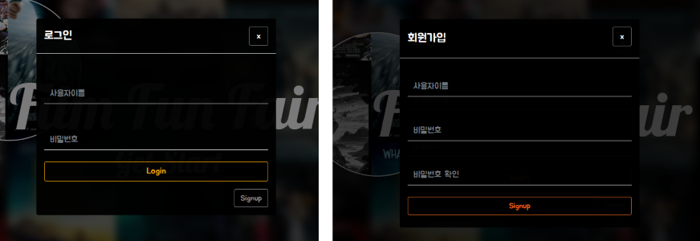

- **MovieList**

  - `Movie Recommendation`

    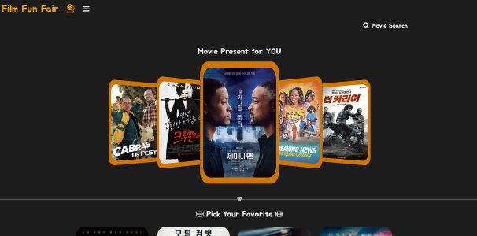

  - `Movie Search`

    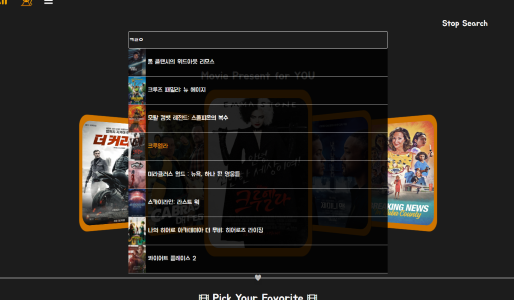

  - `Movie List`

    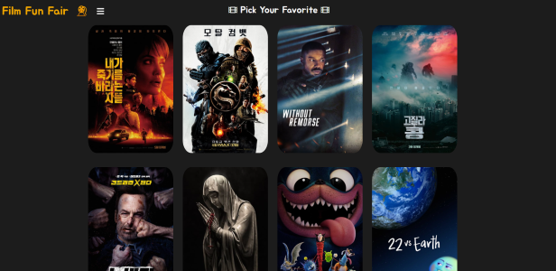

  - `Movie Caption`

    

  - `Movie Detail Modal`

    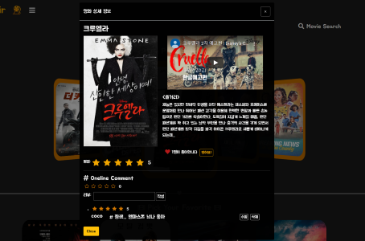

- **Mypage**

  - `Like Movie` & `Watched Movie`

    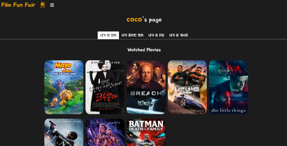

  - `My Review`

    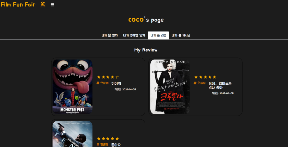

  - `My Post`

    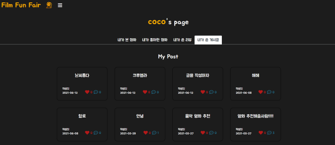

- **Community**

  - `Community List`

    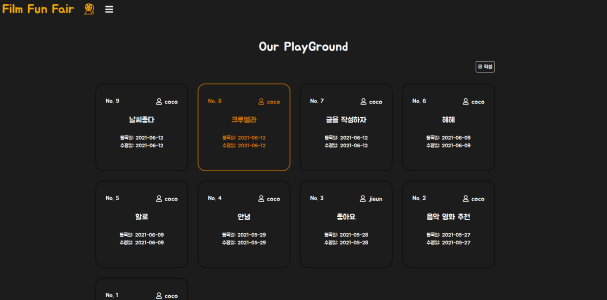

  - `Community Detail`

    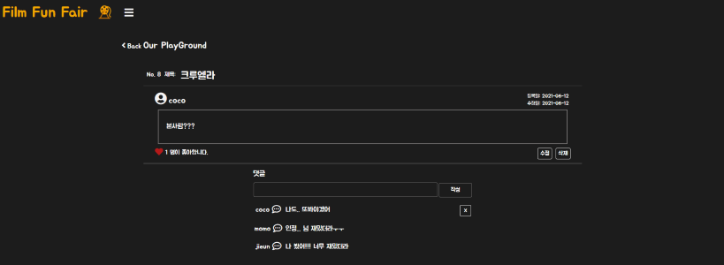

  - `Update & Create Form`

    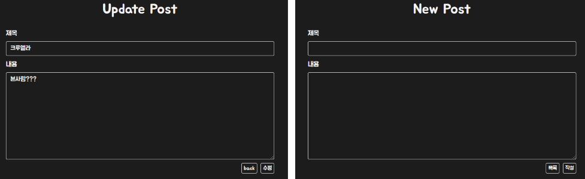

- **Random**

  - `card`

    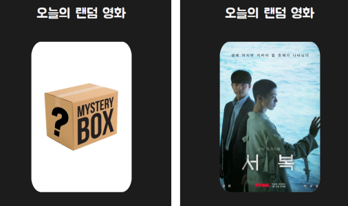
